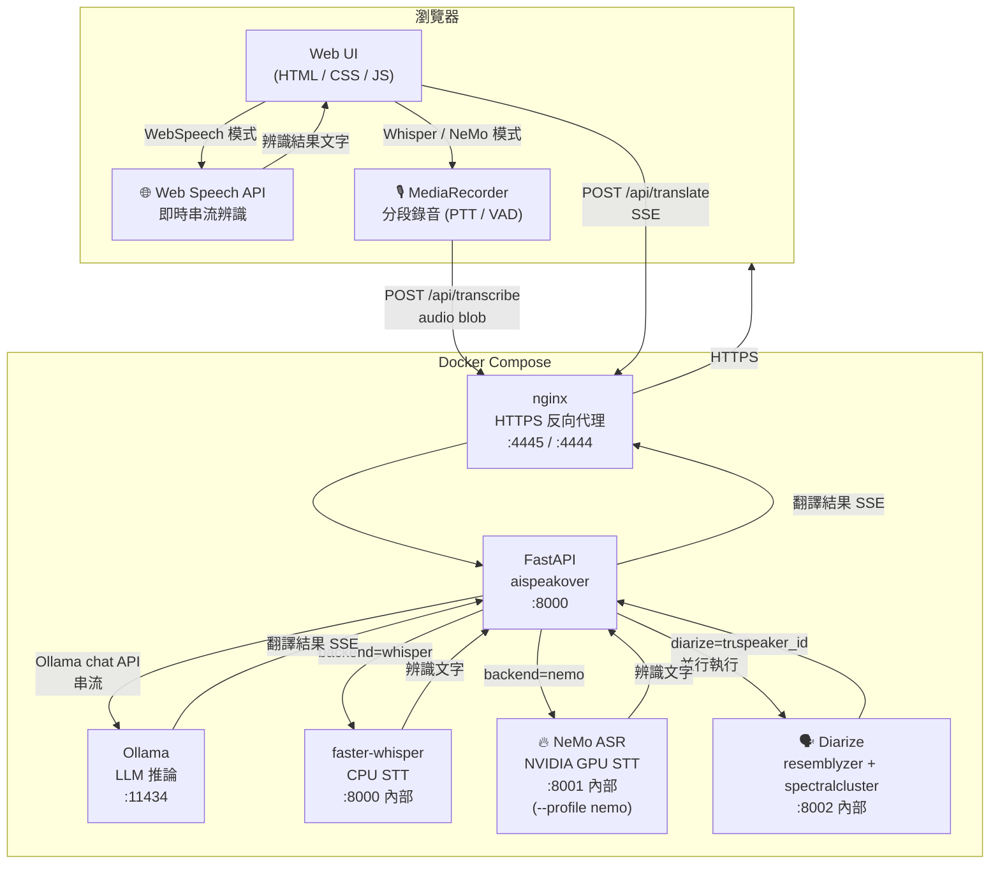

# 🎙 AiSpeakOver

即時語音識別 + 本地 AI 翻譯的網頁應用。對著麥克風說話，自動翻譯為目標語言。

## 架構



> 麥克風需要 HTTPS，nginx 會自動產生自簽憑證。

## 功能

- 即時語音辨識，可選擇三種模式：
  - **🌐 Web Speech**（瀏覽器原生，低延遲，需網路）
  - **🤫 Whisper 本地**（faster-whisper，完全離線，中日韓準確度更高）
  - **🔥 NeMo (NVIDIA)**（NVIDIA NeMo，GPU 加速，最高準確度）
- **⇌ 雙向翻譯模式**（自動講者辨識）：
  - 不需按鈕，透過 **resemblyzer GE2E** 營造聲紋実現自動講者分別
  - **spectralcluster** 定期重新核算特徵展，提升辨識穩定性
  - 講者 A / B 辨識結果與翻譯分剛左右面板即時顯示
  - STT 與講者辨識並行執行，回應延遲最小化
- Ollama 本地 LLM 串流翻譯，不需要雲端 API
- 支援 5 種語言互譯：繁體中文、簡體中文、English、日本語、한국어
- UI 直接切換模型 / 從 Ollama library 下載模型
- Docker Compose 一鍵部署

## 語音辨識模式比較

| 模式 | 延遲 | 離線 | 硬體需求 | 瀏覽器限制 |
|---|---|---|---|---|
| 🌐 Web Speech | 極低（即時串流） | 否，送 Google/Microsoft | 無 | Chrome / Edge 專用 |
| 🤫 Whisper 本地 | 稍高（每句傳送） | 是 | CPU | 任何支援 MediaRecorder |
| 🔥 NeMo (NVIDIA) | 低（GPU 加速） | 是 | NVIDIA GPU | 任何支援 MediaRecorder |

切換方式：右上角 STT 下拉選單。Whisper / NeMo 均以 **PTT（按住說話）** 為觸發依據；單人模式另有 VAD 自動分段。

**預設值：**
- 標準部署（CPU）：預設 **Whisper 本地**
- NeMo profile 部署：在 `config.yaml` 設定 `default_stt: "nemo"` 或加環境變數 `DEFAULT_STT=nemo`

## 雙向翻譯模式

點擊右上角 **⇌ 雙向** 按鈕切換。

```
┌─────────────────────┬─────────────────────┐
│  說話者 A           │  說話者 B           │
│  [語言選擇]  → B語  │  [語言選擇]  → A語  │
│  🎤 A說話（按此）   │  🎤 B說話（按此）   │
│  ─ 辨識文字 ─       │  ─ 辨識文字 ─       │
│  ↓ 翻譯             │  ↓ 翻譯             │
│  ─ 翻譯結果 ─       │  ─ 翻譯結果 ─       │
└─────────────────────┴─────────────────────┘
```

- 每次只有一人可錄音，再按一次停止
- 結束後自動送出辨識 → 翻譯，結果顯示在同一欄
- 支援全部三種 STT 模式（Web Speech / Whisper / NeMo）

## 快速開始

### 前置需求

- Docker + Docker Compose
- 支援 Web Speech API 的瀏覽器（Chrome / Edge）

### 啟動（標準，CPU only）

```bash
docker compose up -d
```

第一次啟動時，`ollama-init` 容器會自動拉取預設模型（`qwen2.5:1.5b`，約 1.1 GB）。

### 啟動（含 NeMo GPU 加速）

```bash
docker compose --profile nemo up -d
```

> ⚠️ 需要 NVIDIA GPU + nvidia-container-toolkit。首次 pull `nvcr.io/nvidia/nemo` 映像約 **20 GB**。

### 開啟網頁

```
https://localhost:4445
```

> 瀏覽器會警告「不安全的連線」（自簽憑證），點選「繼續前往」即可。

## 設定

編輯 `config.yaml`，重啟容器後生效：

```yaml
# Ollama 服務位址
ollama_base_url: "http://ollama:11434"

# 預設翻譯模型
default_model: "qwen2.5:1.5b"

# 預設語言對
default_source_lang: "zh-TW"   # zh-TW / zh-CN / en / ja / ko
default_target_lang: "en"

# Whisper STT
whisper_base_url: "http://whisper:8000"
whisper_model: "Systran/faster-whisper-small"

# NeMo ASR (需 --profile nemo)
nemo_base_url: "http://nemo-asr:8001"
nemo_model: "stt_zh_conformer_ctc_large"
```

也可以透過環境變數覆蓋：

| 環境變數 | 說明 |
|---|---|
| `OLLAMA_BASE_URL` | Ollama 服務位址 |
| `WHISPER_BASE_URL` | faster-whisper 服務位址 |
| `NEMO_BASE_URL` | NeMo ASR 服務位址 |

### 推薦 LLM 模型（Ollama）

| 模型 | 大小 | 說明 |
|---|---|---|
| `qwen2.5:1.5b` | 1.1 GB | 小巧快速，支援中╱日╱韓↔英 |
| `qwen2.5:3b`   | 2.0 GB | 品質較佳，多語言 |
| `qwen2.5:7b`   | 4.7 GB | 高品質翻譯 |
| `gemma3:1b`    | 0.8 GB | 超小，英文為主 |
| `llama3.2:3b`  | 2.0 GB | 平衡速度與品質 |

### 推薦 NeMo ASR 模型

| 語言 | 模型 |
|---|---|
| 中文 | `stt_zh_conformer_ctc_large` |
| 英文 | `nvidia/parakeet-tdt-0.6b-v2` |
| 日文 | `stt_ja_fastconformer_hybrid_large` |
| 韓文 | `stt_ko_conformer_ctc_large` |

## GPU 加速（Whisper，選用）

修改 `docker-compose.yml` 中 `whisper` 服務，將映像由 `latest-cpu` 改為 `latest-cuda`：

```yaml
  whisper:
    image: fedirz/faster-whisper-server:latest-cuda
    deploy:
      resources:
        reservations:
          devices:
            - driver: nvidia
              count: all
              capabilities: [gpu]
```

## GPU 加速（Ollama，選用）

編輯 `docker-compose.yml`，取消 `ollama` 服務的 GPU 區塊注釋：

```yaml
deploy:
  resources:
    reservations:
      devices:
        - driver: nvidia
          count: all
          capabilities: [gpu]
```

需要先安裝 [nvidia-container-toolkit](https://docs.nvidia.com/datacenter/cloud-native/container-toolkit/install-guide.html)。

## 使用外部 Ollama

若已有運行中的 Ollama 實例，修改 `config.yaml`：

```yaml
ollama_base_url: "http://<host>:11434"
```

並移除 `docker-compose.yml` 中的 `ollama` 與 `ollama-init` 服務。

## 專案結構

```
├── config.yaml          # 主要設定檔
├── docker-compose.yml   # 容器編排（ollama / whisper / diarize / nemo-asr / aispeakover / nginx）
├── Dockerfile           # FastAPI 映像
├── app/
│   ├── main.py          # FastAPI 後端（翻譯 API + 辨識代理 + 雙向講者重設）
│   ├── requirements.txt
│   └── static/          # 前端（HTML / CSS / JS）
├── diarize/
│   ├── server.py        # 講者辨識服務（resemblyzer + spectralcluster）
│   ├── Dockerfile
│   └── requirements.txt
├── nemo-asr/
│   ├── server.py        # NeMo ASR 服務（OpenAI-compatible API）
│   ├── Dockerfile       # 基於 nvcr.io/nvidia/nemo
│   └── requirements.txt
└── nginx/
    ├── nginx.conf        # HTTPS 反向代理設定
    └── gen-cert.sh       # 自簽憑證產生腳本
```

## API 端點

| 方法 | 路徑 | 說明 |
|---|---|---|
| `GET` | `/api/config` | 目前設定值 |
| `GET` | `/api/models` | 已安裝模型列表 |
| `GET` | `/api/library` | 推薦模型列表 |
| `POST` | `/api/pull` | 下載模型（SSE 串流進度） |
| `POST` | `/api/translate` | 翻譯文字（SSE 串流回應） |
| `POST` | `/api/transcribe` | 音訊辨識 → 文字（`diarize=true` 加講者辨識） |
| `POST` | `/api/diarize/reset` | 清除講者狀態（下一位說話者重新成為 A） |

## 常見問題

**雙向模式講者辨識不準**  
按下 **🔄 重設講者** 可清除講者嵌入學習紀錄。建議對話開始前先重設一次。  
首次進入雙向模式時，第一位說話者會被辨識為講者 A。

**雙向模式不支援 Web Speech**  
進入雙向模式時會自動切換為 Whisper，因為 Web Speech 無法提供原始音訊給講者辨識使用。

**Whisper 辨識速度慢**  
CPU 模式下 `small` 模型每段約 1–2 秒，可改為 `tiny` 或 `base` 加快，或改用 NeMo (NVIDIA GPU)。

**Whisper 模型尚未下載**  
第一次啟動 `whisper` 容器時會自動從 HuggingFace 下載模型（`Systran/faster-whisper-small` 約 244 MB），需稍候。

**NeMo 容器啟動很慢**  
首次 pull `nvcr.io/nvidia/nemo` 映像約 20 GB，NeMo 模型首次下載亦需數分鐘，屬正常現象。

**NeMo 模式辨識失敗**  
確認已使用 `--profile nemo` 啟動，且主機有 NVIDIA GPU 並已安裝 nvidia-container-toolkit。

**麥克風無法使用**  
瀏覽器需要 HTTPS 才能存取麥克風，請確認使用 `https://localhost:4445`。

**Web Speech API 不支援**  
請使用 Chrome 或 Edge 瀏覽器。

**翻譯速度很慢**  
改用較小的 LLM 模型（如 `qwen2.5:1.5b`），或啟用 GPU 加速。

**憑證警告**  
這是正常現象（自簽憑證），在瀏覽器警告頁面點選「進階」→「繼續前往」即可。

## 技術棧

- **後端**：FastAPI + uvicorn + httpx
- **LLM**：Ollama（本地推論）
- **STT**：faster-whisper / NVIDIA NeMo ASR
- **講者辨識**：resemblyzer GE2E 嵌入 + spectralcluster 特徵展重測
- **前端**：原生 HTML / CSS / JavaScript，Web Speech API + MediaRecorder
- **代理**：nginx（TLS 終止 + HTTP→HTTPS 重導）
- **容器**：Docker Compose（profiles 支援選用服務）